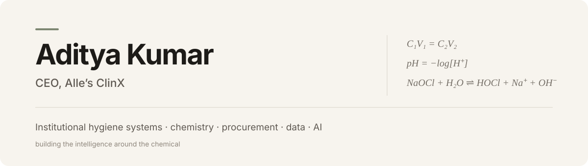
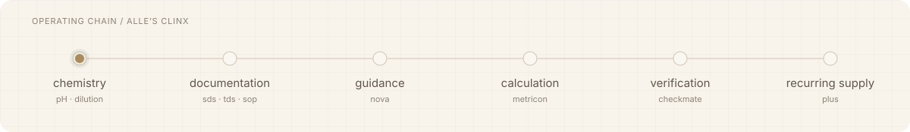

  

  <a href="https://allesclinx.com/">Alle’s ClinX</a> ·
  <a href="https://github.com/alles-clinx">Company GitHub</a> ·
  <a href="https://allesclinx.com/checkmate/">CheckMate</a> ·
  <a href="https://allesclinx.com/metricon/">Metricon</a> ·
  <a href="https://allesclinx.com/plus/">Plus</a>

## What I’m building

I lead **Alle’s ClinX**, the institutional hygiene systems brand operated by **Champaran Innovatives Private Limited**.

The work starts with a physical product and a very ordinary operational problem: facilities need the right chemistry, the right documents, the right usage instructions and a supply system that does not fall apart after purchase.

The software layer exists to make that physical system easier to specify, measure, verify and run.

> **The chemical does the physical work. The intelligence belongs around it.**

From dilution logic to pH behavior to evidence checks, I’m interested in building the operating layer around institutional chemistry.

  

## The operating system

| System | Role |
|---|---|
| [Solutions](https://allesclinx.com/solutions/) | Turns facility requirements into product and procurement decisions |
| [Nova](https://allesclinx.com/about-nova/) | Product and technical guidance grounded in Alle’s ClinX information |
| [Metricon](https://allesclinx.com/metricon/) | Chemistry, dosage, usage, procurement and cost calculations |
| [CheckMate](https://allesclinx.com/checkmate/) | Checks evidence across products, documents, procurement and delivery |
| [Plus](https://allesclinx.com/plus/) | Recurring institutional supply and operating support |
| [Document Center](https://allesclinx.com/support/media-documents/) | Public technical and operational documentation |

## How I think about it

I am less interested in making cleaning look like software than in making institutional hygiene **less fragmented**.

A product should be connected to its specification, safety information, usage logic, procurement context and replenishment cycle. When those pieces agree, the facility gets something more useful than another chemical SKU.

## Public infrastructure

The [Alle’s ClinX GitHub organization](https://github.com/alles-clinx) is the public technical layer behind part of that work. It includes structured product data, document indexes, governance files and a growing technical library.

For the legal and corporate relationship between the company and brand, see the [Champaran Innovatives Private Limited](https://allesclinx.com/champaran-innovatives-private-limited/) reference page.

---

  <strong>Aditya Kumar</strong> 
  CEO, Alle’s ClinX  
  <a href="https://allesclinx.com/">allesclinx.com</a> ·
  <a href="https://github.com/alles-clinx">github.com/alles-clinx</a>

